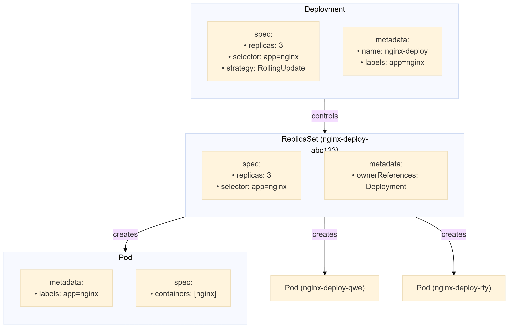

# Deployment (Развертывание) в Kubernetes

Офицальная документация *Deployment*: [https://kubernetes.io/docs/concepts/workloads/controllers/deployment/](https://kubernetes.io/docs/concepts/workloads/controllers/deployment/)

---

### **1. Что такое Deployment?**

**Deployment** — это контроллер Kubernetes для управления **приложениями в виде Pod'ов**, обеспечивающий:

* **Декларативные обновления** (описываете желаемое состояние — Deployment приводит систему к нему)
* **Развертывание и масштабирование** приложений
* **Откат к предыдущей версии** при неудачном обновлении
* **Автоматическое восстановление** Pod'ов при сбоях

**Аналог в мире IT**:  
Deployment похож на систему управления версиями для вашего приложения в Kubernetes (например, как Git для кода, но для работающих экземпляров программы).

---

### **2. Как работает Deployment?**

1. Вы описываете **желаемое состояние** приложения (образ контейнера, количество реплик и т.д.) в YAML-файле.
2. Deployment через **ReplicaSet** создает/удаляет Pod'ы, чтобы достичь этого состояния.
3. При обновлении Deployment создает **новый ReplicaSet** и постепенно заменяет старые Pod'ы новыми (стратегия rolling update).

**Визуализация**:

```
Deployment (v1)
  └── ReplicaSet (v1)
      ├── Pod (v1)
      └── Pod (v1)
↓ Обновление образа → nginx:1.16 → nginx:1.17
Deployment (v2)
  ├── ReplicaSet (v1) (0 pods)
  └── ReplicaSet (v2)
      ├── Pod (v2)
      └── Pod (v2)
```



---

### **3. Ключевые возможности**

|Функция|Описание|Пример команды|
| ----------------| -------------------------------------------------------------| -----------------------------|
|**Rolling Update**|Постепенное обновление без downtime|​`kubectl set image deployment/nginx nginx=nginx:1.19`​|
|**Rollback**|Возврат к предыдущей версии|​`kubectl rollout undo deployment/nginx`​|
|**Scaling**|Изменение количества реплик|​`kubectl scale deployment nginx --replicas=5`​|
|**Status Monitoring**|Проверка состояния обновления|​`kubectl rollout status deployment/nginx`​|

---

### **4. Пример Deployment YAML**

```yaml
apiVersion: apps/v1
kind: Deployment
metadata:
  name: nginx-deployment
  labels:
    app: nginx
spec:
  replicas: 3  # Количество Pod'ов
  selector:
    matchLabels:
      app: nginx
  template:  # Шаблон Pod'а
    metadata:
      labels:
        app: nginx
    spec:
      containers:
      - name: nginx
        image: nginx:1.16
        ports:
        - containerPort: 80
```

---

### **5. Жизненный цикл Deployment**

1. **Создание**:

    ```sh
    kubectl apply -f deployment.yaml
    ```
2. **Обновление**:  
    Измените YAML-файл и повторно примените или используйте:

    ```sh
    kubectl set image deployment/nginx-deployment nginx=nginx:1.17
    ```
3. **Проверка истории**:

    ```sh
    kubectl rollout history deployment/nginx-deployment
    ```
4. **Откат**:

    ```sh
    kubectl rollout undo deployment/nginx-deployment --to-revision=2
    ```

---

### **6. Стратегии обновления**

```yaml
spec:
  strategy:
    type: RollingUpdate  # Default
    rollingUpdate:
      maxSurge: 1        # Сколько Pod'ов можно создать сверх replicas
      maxUnavailable: 0  # Сколько Pod'ов могут быть недоступны во время обновления
```

Альтернатива — `Recreate`​ (удалить все старые Pod'ы перед созданием новых).

---

### **7. Практические команды**

|Действие|Команда|
| -------------------------------------------------| ----------------|
|Проверить развертывание|​`kubectl get deployments`​|
|Показать детали|​`kubectl describe deployment nginx-deployment`​|
|Обновить образ|​`kubectl set image deployment/nginx-deployment nginx=nginx:1.19`​|
|Приостановить обновление|​`kubectl rollout pause deployment/nginx-deployment`​|
|Возобновить обновление|​`kubectl rollout resume deployment/nginx-deployment`​|

---

### **8. Ограничения**

* Не управляет stateful-приложениями (используйте **StatefulSet**)
* Не подходит для демонов на узлах (используйте **DaemonSet**)
* Для задач с запуском и завершением используйте **Job/CronJob**

---

### **9. Best Practices**

1. Всегда указывайте `selector`​ и `labels`​ в шаблоне Pod'а.
2. Используйте `rollingUpdate`​ для production-сред.
3. Мониторьте обновления через `kubectl rollout status`​.
4. Храните конфигурацию в Git (Infrastructure as Code).
