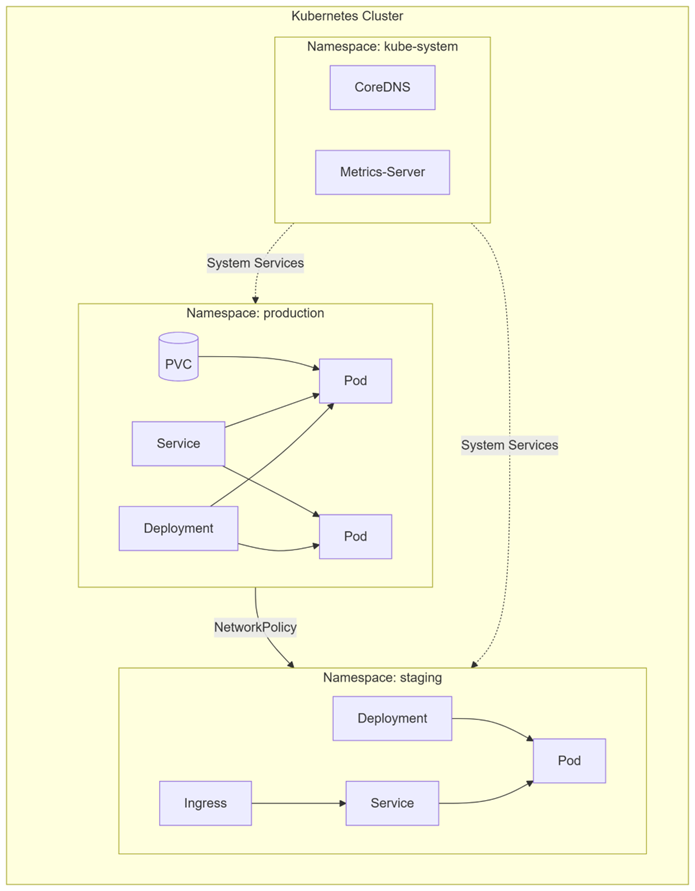
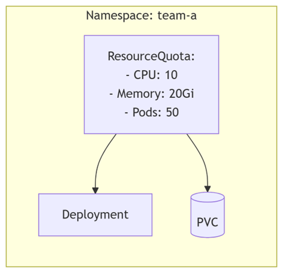

# Пространства имён (Namespaces) в Kubernetes

**Истоничики**:

Офицальная документация *Namespaces*: [https://kubernetes.io/docs/concepts/overview/working-with-objects/namespaces/ ](https://kubernetes.io/docs/concepts/overview/working-with-objects/namespaces/)

---

### **1. Что такое пространство имён?**

**Пространство имён (Namespace)**  — это виртуальный кластер внутри физического Kubernetes-кластера. Оно позволяет разделять ресурсы между несколькими командами, проектами или окружениями (например, `development`​, `staging`​, `production`​).

**Основные цели:**

* Изоляция ресурсов (чтобы Pod'ы, Services, Deployments разных команд не конфликтовали).
* Управление доступом (через RBAC).
* Организация объектов Kubernetes (логическая группировка).

‍



---

### **2. Стандартные пространства имён**

В каждом кластере Kubernetes есть несколько встроенных пространств имён:

* ​**​`default`​**​ – используется по умолчанию, если пространство не указано.
* ​**​`kube-system`​**​ – для системных компонентов (например, `kube-dns`​, `kube-proxy`​).
* ​**​`kube-public`​**​ – для общедоступных ресурсов (редко используется).
* ​**​`kube-node-lease`​**​ – для аренды (lease) узлов (узлы периодически подтверждают свою доступность).

---

### **3. Когда использовать пространства имён?**

Пространства имён полезны в следующих сценариях:

* **Разделение окружений** (`dev`​, `staging`​, `prod`​).
* **Мультитенантные кластеры** (разные команды или клиенты в одном кластере).
* **Ограничение доступа** (например, разработчики имеют доступ только к `dev`​).
* **Управление ресурсами** (можно назначать `ResourceQuotas`​ на каждое пространство).

⚠ **Не используйте пространства имён для изоляции ненадёжных workloads** – для этого лучше использовать отдельные кластеры.

---

### **4. Создание и управление пространствами имён**

#### **Создание Namespace через YAML-манифест**

```yaml
apiVersion: v1
kind: Namespace
metadata:
  name: my-namespace
```

#### **Создание через** **​`kubectl`​**​

```sh
kubectl create namespace my-namespace
```

#### **Просмотр списка Namespaces**

```sh
kubectl get namespaces
# ИЛИ сокращённо:
kubectl get ns
```

#### **Удаление Namespace**

```sh
kubectl delete namespace my-namespace
```

⚠ **Будьте осторожны!**  Удаление Namespace приведёт к удалению всех ресурсов внутри него.

---

### **5. Работа с ресурсами в Namespace**

#### **Указание Namespace при создании ресурса**

```yaml
apiVersion: v1
kind: Pod
metadata:
  name: my-pod
  namespace: my-namespace  # Указываем пространство имён
spec:
  containers:
  - name: nginx
    image: nginx
```

#### **Фильтрация ресурсов по Namespace**

```sh
kubectl get pods --namespace=my-namespace
# ИЛИ сокращённо:
kubectl get pods -n my-namespace
```

#### **Переключение текущего Namespace в** **​`kubectl`​**​

```sh
kubectl config set-context --current --namespace=my-namespace
# После этого все команды будут выполняться в выбранном Namespace.
```

---

### **6. Ограничения ресурсов (ResourceQuotas)**

В Kubernetes можно задавать квоты на ресурсы (CPU, RAM, количество Pod'ов и т. д.) для каждого Namespace.

**Пример** **​`ResourceQuota`​**​ **:**

```yaml
apiVersion: v1
kind: ResourceQuota
metadata:
  name: my-quota
  namespace: my-namespace
spec:
  hard:
    requests.cpu: "2"
    requests.memory: 4Gi
    limits.cpu: "4"
    limits.memory: 8Gi
    pods: "10"
```



---

### **7. DNS внутри Namespace**

Сервисы внутри одного Namespace могут обращаться друг к другу по короткому имени (например, `my-service`​).  
Если сервис находится в другом Namespace, нужно указывать полное доменное имя (FQDN):  
​`my-service.other-namespace.svc.cluster.local`​.

---

### **8. Когда НЕ нужно использовать Namespace?**

* В небольших кластерах с одной командой (можно обойтись `default`​).
* Если нужна полная изоляция (лучше использовать отдельные кластеры).
* Для разделения узлов (используйте `nodeSelector`​ и `taints/tolerations`​).

---

### **9. Команды для работы с Namespace**

|Команда|Описание|
| ----------------| ---------------------------------------------------------------|
|​`kubectl get ns`​|Список всех Namespace|
|​`kubectl create ns my-ns`​|Создать Namespace|
|​`kubectl delete ns my-ns`​|Удалить Namespace|
|​`kubectl get pods -n my-ns`​|Показать Pod'ы в определённом Namespace|
|​`kubectl config set-context --current --namespace=my-ns`​|Переключиться на Namespace|

---

‍
