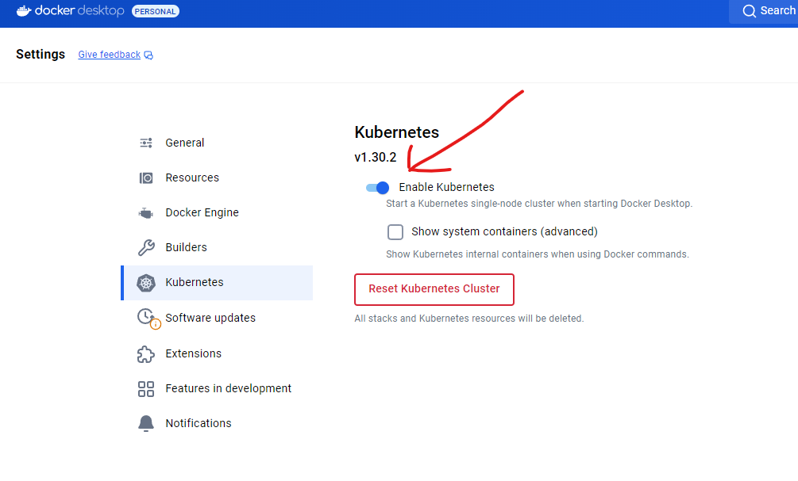

# Лаборная работа

## Настройка рабоы в Kubernetes

1. В ключите поддержку kubernetes в Docker Desktop

​​

> ***Minikube***  
> *Если вы не хотите или не можете использовать поддержку Kubernetes в Docker Desktop, у вас есть альтернатива: всеми любимая система Minikube. Как и Docker Desktop, она предоставляет одноузловой кластер Kubernetes, который работает на вашем собственном компьютере (на самом деле он запущен внутри виртуальной машины, но это неважно).
> Чтобы установить Minikube, следуйте инструкциям по адресу kubernetes.io/docs/ tasks/tools/install-minikube.*

2. Склонируйте репозиторий

```yaml
https://github.com/AllikarDD/VS-lab1-kubernetes.git
```

3. Зайдите в папку ***Documentation/Pods/examples***
4. Запустите поду из файла ***simple-pod.yaml***

```yaml
kubectl apply -f simple-pod.yaml
```

5. Проверьте какой статус под

```yaml
kubectl get pods
```

---

6. Запустите поду из файла ***simple-job.yaml***

```yaml
kubectl apply -f simple-job.yaml
```

7. Посмотрите подробную информацию о поде

```yaml
kubectl describe pod <имя-pod'а>
```

---

8. Запустите поду из файла ***simple-liveness.yaml***

```yaml
kubectl apply -f simple-liveness.yaml
```

9. Проверьте какой статус под

```yaml
kubectl get pods
```

10. Через минуту проверьте еще раз статус под

```yaml
kubectl get pods
```

---

11. Запустите поду из файла ***simple-sidecar.yaml***

```yaml
kubectl apply -f simple-sidecar.yaml
```

12. Проверьте какой статус под

```yaml
kubectl get pods
```

13. Проверьте логи контейнера log-processor

```yaml
kubectl logs <имя-pod'а> -c <имя-контейнера>

```

---

14. Запустите поду из файла ***simple-init.yaml***

```yaml
kubectl apply -f simple-init.yaml
```

15. Проверьте какой статус под

```yaml
kubectl get pods
```

16. Проверьте логи

```yaml
kubectl logs <имя-pod'а> 

```

---

17. Попробуйте удалить все поды

```yaml
kubectl delete pod <имя-pod'а>

```

18. Проверьте какой статус под

```yaml
kubectl get pods
```

---

**Задание 1**

1. Настройте `port-forwarding`​ для поды ***simple-pod.yaml***
2. Посмотрите какой будет результат работы поды в браузере

‍

‍

‍
