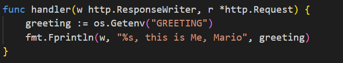

# Lab2

1. Для начала склонируйте репозитори https://github.com/AllikarDD/VS-labs-kubernetes
‍

```bash
https://github.com/AllikarDD/VS-labs-kubernetes.git
```

# Volumes (Тома)

1. В папке `Documentation/Volumes/examples`​ создайте Volumes

```shell
apply -f simple-volume.yaml
```

2. Зайдите в поду и посмотрите создалась ли папка

# Ephemeral Volumes (Временные тома)

1. В папке `Documentation/Ephemeral Volumes/examples`​ создайте Ephemeral Volumes

```shell
kubectl apply -f simple-ephemeral-volume.yaml
```
2. Зайдите в поду и посмотрите создалась ли папка


# Secrets (Секреты)

1. В папке `Documentation/Secrets/examples`​ создайте секрет

```shell
kubectl apply -f simple-secret.yaml
```

2. Создайте поду с контейнером nginx

3. Добавьте секреты в этот контейнер через Volume

4. Зайдите в этот контейнер
5. Посмотрите что будет лежать в папке с секртами


# ConfigMap

1. В папке `Documentation/ConfigMap/examples`​ создайте ConfigMap

```shell
kubectl apply -f simple-configmap.yaml
```

2. Зайдите в поду 
3. Проверьте значения переменных окружения, которые мы добавили

4. В файле Lab2/main.go измените код как показано на скриншоте ниже
   

5. Создайте конфигмапу 

```yaml
apiVersion: v1
kind: ConfigMap
metadata:
  name: demo-config
data:
  greeting: Hola
```
6. Добавьте ConfigMap в контейнер, который мы создавали в файле  Lab2/deployment.yaml
```yaml
  envFrom:
    - configMapRef:
    name: demo-config
```

7. Запустите поду и посмотрите что получилось
8. Попробуйте отредактировать ConfigMap и обновите конфигурацию с помощью команды apply
9. Посмотрите поменялось ли что-то в вашем поднятом приложении 
10. Попробуйте удалить поду 
11. После поднятия поды, посмотрите применилась ли конфигурация 